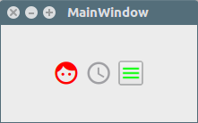

Qt Material Icons Library
========================

The QMaterialIcons library is an easy way to use [Google's material icons](https://design.google.com/icons/) inside a Qt Widget application.

The library provides all icon codes, handles resources loading and type conversion to get QFont, QPixmap or QIcon in any color and size.

It's distributed as a multi-platform static library that can be easily integrated in your app.

Screenshots
-----------

Installation
------------

Installation is done as with any other static library. If you don't know how to install a static lib, Qt provides a nice [tutorial](http://doc.qt.io/qtcreator/creator-project-qmake-libraries.html) on that.

Another way is to put the files libQMaterialIcons.(lib or a) and qmaterialicons.h++ inside a directory /lib in you root source tree. Then add the following code to your .pro file.

    #-------------------------------------------------------------------------------
    # This part loads the library.
    #-------------------------------------------------------------------------------
    # Include search paths.
    INCLUDEPATH += $$PWD/lib
    DEPENDPATH += $$PWD/lib

    # Select debug or release version.
    CONFIG(debug, debug|release): LIBS += -L$$PWD/lib/ -lQMaterialIconsd
    else:CONFIG(release, debug|release): LIBS += -L$$PWD/lib/ -lQMaterialIcons

    win32:!win32-g++ {
      # Microsoft msvc20XX config.
      CONFIG(debug, debug|release): PRE_TARGETDEPS += $$PWD/lib/QMaterialIconsd.lib
      else:CONFIG(release, debug|release): PRE_TARGETDEPS += $$PWD/lib/QMaterialIcons.lib
    }
    else {
      # GCC or mingw config.
      CONFIG(debug, debug|release): PRE_TARGETDEPS += $$PWD/lib/libQMaterialIconsd.a
      else:CONFIG(release, debug|release): PRE_TARGETDEPS += $$PWD/lib/libQMaterialIcons.a
    }

Also, you can copy the header, source and resources to your project directory and include it directly inside your project.

Using as a git submodule
------------------------

    # add QMaterialIcons as a git module
    git submodule add https://github.com/DKrepsky/QMaterialIcons.git

    # include it to your project file
    include(QMaterialIcons/QMaterialIcons.pri)

Build Instructions
------------------

If you want to build the library yourself, open the QMaterialIcons.pro project file inside the source directory and compile.

Usage
-----

Before you start using the lib, it's necessary to load the resources. this is done by invoking QMaterialIcons::load() function. This must be done only once, and can be in your main.cpp file or at the main window constructor. Note that load must be called after the QApplication object instantiation.

The example bellow shows how to load all resources inside your main routine.

    // You can load the resources inside you main.cpp or at the main window
    // constructor.
    #include "mainwindow.h++"
    #include <QApplication>
    #include "qmaterialicons.h++"
    int main(int argc, char *argv[]) {
      QApplication a(argc, argv); // <- make sure resources are loaded after the
                                  //  QApplication instantiation.
      QMaterialIcons::load(); // <- The magic happens here.
      MainWindow w;
      w.show();
      return a.exec();
    }

To use an icon as normal text and customize it with a stylesheet, use QMaterialIcons::getFont(), and set the icon with mi::icon.

    // This example shows how to set a label font with QMaterialIcons.
    // First, grab the font object.
    ui->label->setFont(QMaterialIcons::getFont());
    // Set text to desired icon.
    // Note that it is important to use a QChar to convert the wchar to text.
    ui->label->setText(QChar(mi::heart));
    // Use stylesheet to customize.
    ui->label->setStyleSheet("color:red;font-size:30px;");
    // Depending on the label dimensions, you should resize it.
    ui->label->setFixedSize(30,30);

To generate an icon, use QMaterialIcons::getIcon().

    // This example shows how to set a push button icon.
    // For icons, there is no need to use QChar.
    ui->button->setIcon(QMaterialIcons::getIcon(mi::menu, Qt::black, 18));

License
-------
The QMaterialIcons library is licensed under the MTI license. Please, see the [license](@ref license) terms for detailed info.

Copyright David Krepsky - 2016.

Acknowledgments
----------------

Many thanks to:

  + [Qt guys](http://qt.io);
  + [The Google folks](www.google.com);
  + [Velron](https://github.com/Velron/doxygen-bootstrapped) for the beautiful doxygen style;
  + Also check gamecreature's [QtAwesome](https://github.com/gamecreature/QtAwesome) fonts.
